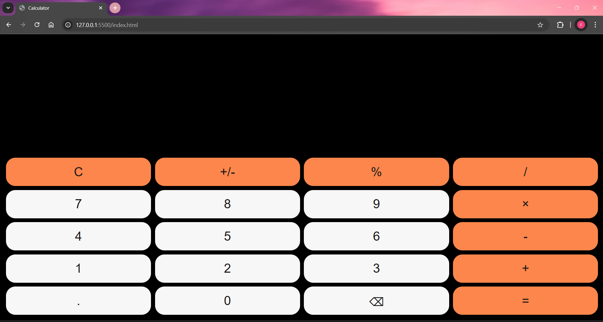

# 🧮 Calculator App

A simple and responsive Calculator Web App built using **HTML**, **CSS**, and **JavaScript**. It performs basic arithmetic operations like addition, subtraction, multiplication, and division.

## 🚀 Demo

👉 [Live Demo](#) &nbsp; *(Replace with your GitHub Pages link if deployed)*

## 📸 Screenshots

  

## 💡 Features

- Basic arithmetic operations: `+`, `-`, `×`, `/`
- Clear & delete functionality
- Responsive design
- Keyboard support *(optional if added)*

## 🛠️ Built With

- 🧱 HTML – Page structure
- 🎨 CSS – Styling and layout
- ⚙️ JavaScript – Functionality and logic

## 📁 Project Structure

